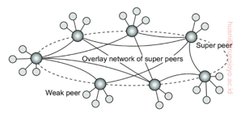
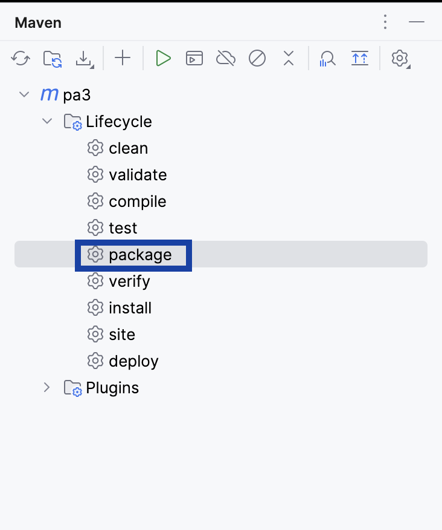

# Hierarchical-p2p

#### Implementation of a hierarchical peer-to-peer (P2P) system.

### Step: Build
* To create build jar, import the project in IDE(IntelliJ) - Build
* go to Maven configurations - lifecycle - package to generate the jar, which is created as - target/pa3-1.0-SNAPSHOT.jar

### Step: Run
* change current directory to src  
    `cd src`
* use run_peer.sh to start super peers.  
`./run_peer.sh <super-peer-number> <topology-type>`

where <topology-type> can be **T** or **A2A**  
_(T: Tree topology, A2A: All-to-all topology)_  

Example: 
`./run_peer.sh 1 A2A`  
This starts a Super-peer 1 with all-to-all topology.

`./run_peer.sh 2 T`  
This starts a Super-peer 2 with tree topology.

* Initialize and start super-peers as needed in different terminals.
* The neighbouring weak peers are configured using the topology configuration files (_tree-topology.txt_ and _all-to-all-topology.txt_)
* Available shared directories with files are at location /dirs/Peer*. Path for this can be configured in `config.properties` file.
* generate_files.sh can also be used to generate sample directories containing random number of files. (run as `./generate_file.sh`)
* Follow instructions on screen - enter file-names for querying and downloading files.